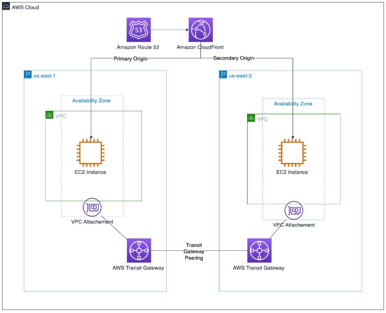
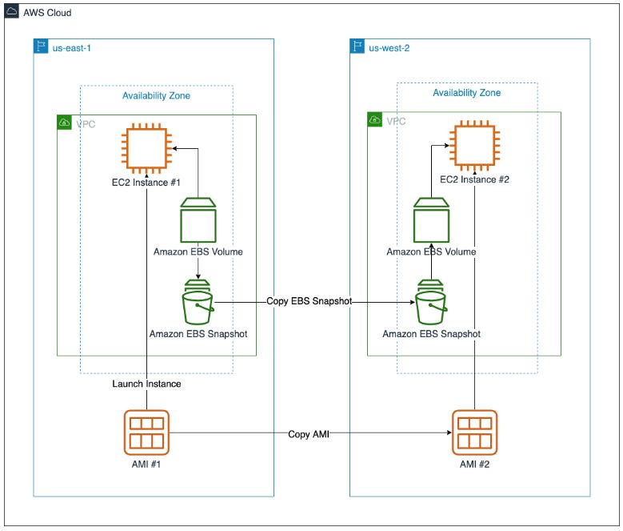
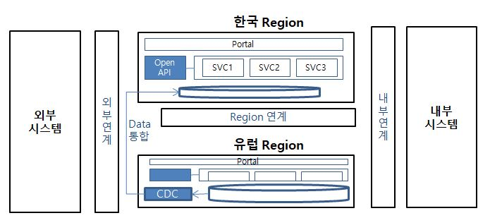
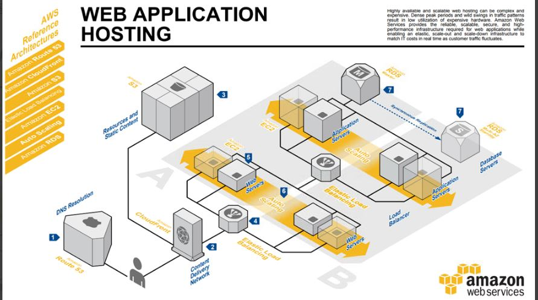
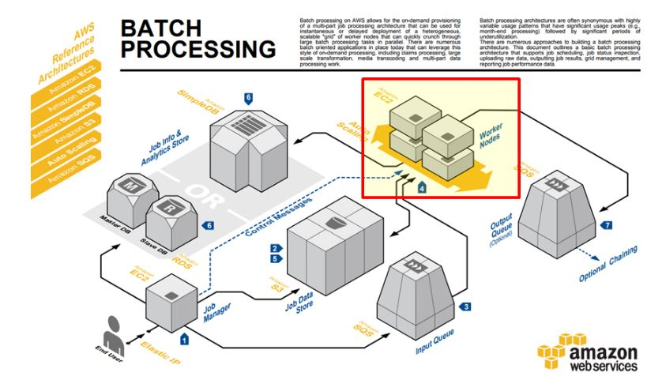

글로벌 서비스를 위한 시스템 구축 시 아키텍처 검토사항 및 시스템 설계 방안

# 1. 아키텍처 검토사항
AWS 아키텍처 다이어그램

## AWS 멀티 리전 아키텍처 구성 가이드
### 1. 보안 고려 사항
- AWS IAM : 누가 어떤 조건에서 어떤 리소스에 엑세스할 수 있는지 지정
- Secret Manager : DB 엑세스하기 위한 자격 증명 안전하게 저장, 교체
- KMS : AWS 서비스 전반에 걸쳐 암호화에 사용됨
- AWS CloudTrail : 사용자 활동 및 API 사용량 기록, 멀티리전에서 생상된 로그를 단일 S3 버킷으로 합칠 수 있음
- AWS Security Hub : 보안 경고/현황을 표준화된 형식으로 통합 집계하고 단일 리전에 연결해 중앙 집중화된 보안 현황 제공
### 2. 네트워크 
- VPC 피어링 : VPC 피어링이 있는 계정과 리전간 프라이빗 라우팅 제공 (IGW, VPN등 없이)
- AWS Transit Gateway : VPC 피어링 숫자가 관리 범위 넘어갈 때 사용
- Route53 : 사용자를 분산 인터넷 응용 프로그램으로 라우팅, 가용성과 확장성이 뛰어난 DNS 서비스, 라우팅 정책은 대기시간 가장 짧은 레코드로 트래픽 라우팅하거나 자동으로 장애 조치 가능
- CloudFront: CDN 기능 + CloudFront 함수를 통해 엣지에서  Lambda 함수 실행 가능
* CDN - GSLB

### 3. 컴퓨팅 계층
- AMI 통해 EC2 인스턴스 생성
- 새 표준 이미지 생성하는 경우 EC2 Image Builder를 통해 AMI를 선택한 리전에 복사 가능
- EBS 볼륨이 단일 AZ에 있지만 Amazon Data Lifecycle Manager 통해 여러 리전에서 EBS 스냅샷 생성/복사 프로세스 자동화 가능
- 컨테이너 사용하는 마이크로서비스 기반 어플리케이션이라면 ECR 이용
* K8S

### 4. 스토리지
### 5. DB
### 6. Application

## 글로벌 시스템 사례
### 개요 및 설계 방향
#### 1. 범위 (레거시 연계, 외부 연동 포함)

#### 2. 설계 방향
- Global 확장성 고려한 Scale-out 아키텍처 적용
- Cloud-native한 아키텍처 설계 (Cloud-native 위한 주요 4요소? DevOps, CI/CD, 컨테이너 기반 인프라, Microservice)
- 보안 Compliance를 충족하는 Cloud 보안 설계
- 표준화된 가이드와 절차 
- 아키텍처 이슈 해결안 제시를 위한 구성검증
### S/W아키텍처 
#### 솔루션
1. WEB/WAS
- 수평적 확장을 고려하여 비용, 효율이 최적화된 제품 도입. (ex. LENA)
2. UI 솔루션 및 F/W
- 요구사항에 따라 업무 집약적 화면이 많다면 UI 솔루션 기반으로, 유연성이나 확장성을 고려한다면 In-House 기반으로 구축하는 것이 유리함
- Cross Browsing, 대량데이터 핸들링 (조회, 엑셀다운 등), WebSocket 적용한 push message 등도 고려
#### 인터페이스
1. AWS Region 간 Data 동기화 방법
- Database 복제 (Replication)
- Database 병합 (CDC 솔루션 사용)
- Legacy EAI 활용
- 인터페이스 직접 구현
- S3 동기화
2. Open API
- Restful API
- 인증 : Access Key/Host 방식
- Agent 제공
- I/F 모니터링 시스템 
- 보안 : SSL적용
#### Application
1. WEB/WAS/Middleware
- Region 구성 : Region 별 WEB/WAS/DB 구성
- Scale-out 용이성 : Stateless 아키텍처 (중앙집중식 Session Server), 관리형 서비스 활용 (ELB, ...)
- AWS 3-Tier 아키텍처

2. 클라우드 아키텍처 (AWS)
- ELB/WEB/WAS 구성 : WEB,WAS 모두 ELB 통한 부하 분산 scale-lout 가능하도록 구성
- 배치 서버 : 배치 작업 데이터는 S3에 업로드, 기동은 Job Manager 어플리케이션이 queue 통해 기동, 작업 상태는 simpleDB 통해 관리
- 세션 공유 : ElastiCache나 DynamoDB 활용해 세션 공유 처리 또는 Sticky Session 기능 활용
- 캐시 서버 : ElastiCache (Memcached, Redis) 사용
- 서버 인스턴스 그룹화 : 그룹별 자동 확장 구성할 수 있음
- LB 구성 : 그룹화된 서버 인스턴스 상단에 구성하여 신규 노드 확장 시에도 자동으로 인식하여 분배 가능
- Stateless 구성 : 세션이나 상태정보를 각 어플리케이션 내부나 해당 어플리케이션이 수행되는 서버 인스턴스 내에 저장하지 않도록 구성
3. 기타 아키텍처 
- In-Memory Data Cache : 자주 엑세스하는 데이터에 대한 Cache 적용하여 고속화 및 DB I/O 감소, MQ로 활용 가능 (Pub/Sub), Redis와 Memcached가 가장 유명
- WebSocket
4. F/W 아키텍처
5. 배치 아키텍처
- AWS Batch 프로세스

6. 빌드/배포 아키텍처
- 개발자는 형상관리 서버에 소스 commit/push
- 개발자/관리자는 Job 스케줄 등록, 실행 관리
- CI 서버(Jenkins) 통한 빌드, 테스트, 리포팅 -> s3에 archive 파일 업로드
- AWS CodeDeploy (배포 관리 로직, 배포 메타 데이터 관리) 통해 배포
- 운영, QA/개발 환경은 별도 VPC 및 배포 그룹으로 구성
#### 인증
1. 인증 및 SSO 연계 아키텍처
- SSO 인증 절차 : 로그인 -> LogOn Ticket 발급 -> Cookie통해 Ticket 전달 to SSO 인증 -> LogOn ID 리턴 -> 사용자 정보 체크 -> 로그인 수행

### 데이터아키텍처
1. 고려사항
- Cloud 적용 DB
- 가용성 설계 : Multi AZ Standby RDS 구성으로 고가용성 확보
- 클라우드 백업 및 복구 : AWS RDS의 Auto Backup policy 준수하되 manual 수동 백업(sanpshot) 가능
- Multi Region 별 DB : 동일 schema 로 구성
- Multi Region간 데이터 동기화
- OSS DB 전환 시 유의사항 : Ansi SQL, schema 정의, procedure/func 최소화하고 application 레벨에서 구현
- 데이터 표준화 방안 설계 : 표준화 (용어, 단어, 도메인)
- 데이터 모델링 및 변경관리 방안
- 클라우드 데이터 보안 설계 : 개인정보 관련 Data 암호화, 컬럼단위 암호화 (솔루션 사용, AWS KMS 등), 파일단위 암호화 
- DB 접근통제 : Dbsafer
2. DB 가용성 설계 및 백업/복구
- RDS는 Multi AZ 구성으로 가용성 확보 및 장애시 동일 End point로 APP 변경 없이 서비스 지속성 보장
- 백업은 자동 백업 (db full + transaction log) 과 수동 백업 (snapshot) 
- 백업은 standby 복제본에서 수행되므로 서비스에 영향 없음
- Read용 복제본은 Read 분산 요구에 따라 선택적 구성
3. 실시간 데이터 통합 방안
- Cross Region Replication 기능 활용한 실시간 데이터 통합 View 제공
- 해외 Region 데이터를 CDC 솔루션 통해 한국 Region의 RDS로 데이터 병합 (CDC 서비스에 대한 관리 point 증가)

### 시스템아키텍처
1. 고려사항
- 클라우드 연계 네트워크 구성 (one source multi instance)
- N/W 용량 산정 및 확장 방안
- 인스턴스 Type 설계
- 스토리지 설계 
- 모니터링

### 보안아키텍처
1. 네트워크 보호 
- UTM/SG 통한 NW 분리/차단
- WAF 통한 해킹 차단
- ELB에 SSL 설치를 통한 전송 구간 암호화 : 폐쇄망으로 구성하되 인터넷 구간은 SSL 적용
2. 서버 보호
- 서버 접근제어 도구 통해 운영자 접근통제
- 서버 내 작업 로깅
3. 응용시스템 보호
- SSO 
- 권한별 화면/메뉴 접근통제
- 세션 timeout 설정 및 동시 접속 통제
- 개인정보 조회 작업 로깅
4. 데이터 보호
- 사용자 비밀번호 암호화
- DB 접근제어 도구 통해 운영자 접근통제
- DB 내 작업 로깅

# 2. 시스템 설계

- 법적인 이슈에 대한 검토도 선행되어야 함. 국가별로 사용자 정보가 반드시 해당 국가에 있어야 한다든지 제약사항이 있음.   
- 시스템 위치 선정도 중요함.

## i18n / L10n
- i18n : 아키텍처나 프레임워크 범위에서 공통으로 처리할 수 있는 영역. 인코딩, 글자, 그림, 음성, 자막, 날짜/시간 형식, 통화, 이름과 직함 등
- L10n : 특정 환경(언어와 문화)에서만 적용되는 내용. 번역, 기호, 정렬의 순서, 현지의 법률이나 관습
### 다국어
- 다국어 시스템이랑 언어와 문화가 다른 사용자가 사용하는 시스템, 언어별로 시스템을 각각 구축하지 않고 시스템을 공유하면서 최소한의 수정으로 여러 언어를 지원할 수 있는 시스템, 국제화/지역화 모두 고려해야함.
#### 아키텍처 설계시 고려사항 - 다국어 적용 절차
- 설계 원칙 수립 -> 구현 프레임워크 선정 -> 추가 개발 및 적용 -> 유지보수
##### 설계 원칙 수립
1. 다국어 요건 분석 : One source multi-language, 언어별 독립적 사용 (L10n 영역)
2. 다국어 적용 대상 식별/분석 : Text (GUI Labels, Messages, Images), Currency, Date, Time, Number format
3. 다국어 적용 설계 원칙 수립 : 환경 설정 (Support Locales, Character Encoding), 데이터 관리 (Locale 의존적 데이터)
4. 다국어 적용 Big Picture 설계 : Runtime Process 설계, 연계/통합 Process 설계 (w/ 솔루션, 내부외부 시스템)
##### 구현 프레임워크 선정 
1. 프레임워크 요건 정의 : Locale 관리 (설정, 식별, 변경), Resource 관리 (국가/언어별 분리 저장, 변경, 관리/동작 반영), 각종 Formatter 제공, 성능
2. 프레임워크 평가 : 기능성, 품질, 적용성
3. 프레임워크 선정 : 평가 결과에 따라 선정
##### 추가 개발 및 적용
1. Gap 분석 : 필요 기능 대비 프레임워크 제공 기능 간 Gap 분석
2. 추가 개발 영역 도출 : 관련 항목 - 지원 가능 언어 목록 관리, Resource Repository 확장, Locale 식별 기준/위치 보완, F/W Message 분리, 오류 처리, 로깅, 코드 정의, 번역, Char Set Converter
3. 추가 개발 및 적용 
##### 유지보수
1. 언어 변경/확장 영향도 분석 : 다국어 대상 변경/증가 시 변경 사항 도출 (환경, 소스)
2. 다국어 의존적 소스/데이터 추가 : 지원 가능 언어 목록 변경, Resource Repository 확장 (파일 추가 or DB 테이블 추가 or DB 컬럼 추가)
3. 시스템 반영 (재기동or 동적) : 동적 refresh, WAS 재기동
#### 아키텍처 설계시 고려사항 - 다국어 처리 흐름

#### 아키텍처 설계시 고려사항 - 다국어 지원 환경 구성
1. OS Locale
2. Database Character set 
- 접속환경의 NLS_DATABASE_PARAMETER 확인
- UTF-8이 일반적이고 이외의 경우 원하는 char set으로 컨버팅 가능하지만 부하가 발생하므로 통일. 
- DB에 직접 접속해서 CRUD하는 경우 접속 도구를 탈 수 있으므로 주의
3. WAS
- WAS의 구동 OS Locale 정보 확인하고, Locale option 지정 (별도 지정 없으면 WAS 구동 User의 Locale 설정을 따름)
- Encoding 옵션은 WAS 실행 시 java 옵션에 -Dfile.encoding 
4. File Encoding
- 별도 설정이 없으면 Default OS Locale 따르므로 명시적 UTF-8 설정
- 빌드 시 Locale option, 실행 시 Encoding option
- properties는 경우에 따라 ISO-8859-1 이나 UTF-8
#### 아키텍처 설계시 고려사항 - 프레임워크 필요 기능
1. Locale 식별/설정/변경
- 사용자의 현재 Locale 식별/설정/변경
- 식별 시 순서 정의 필요 (ex. 세션 -> 브라우저 헤더 -> 시스템 디폴트)
- 디폴트 Locale (지원하지 않는 Locale일 경우)
2. Resource 관리
- Message를 외부 리소스에 저장해 관리
- 최종 출력 메세지 조립을 위해 파라미터 전달 기능
- 언어별 properties 파일로 분리
- 유지보수 용이성을 위해 언어별 테이블 or 컬럼 구분하여 DB로 관리
- 성능 고려한 캐싱
- WAS 재기동 없이 메세지 변경을 위해 Refresh 기능
3. Formatter 
- 숫자, 통화, 날짜, 시간
#### 아키텍처 설계시 고려사항 - Advanced
1. 이미지
- 글자 이용한 이미지 사용 피하되, 필요시 이미지 저장 dir 분리해서 관리
2. 화면 레이아웃
- 단어의 길이 고려 (미리 완벽한 설계할 수 없고 테스트하면서 추가 작업)
- 문화에 따라 오른쪽에서 왼쪽으로 읽는 경우 메뉴 위치를 우측으로 옮기는 등의 고려 필요
3. Logging, Exception
- Message는 다국어 처리 고려해야하지만 Logging, Exception의 경우 개발자가 사용하므로 개발자의 언어로 표기하고 사용자에게 전달되는 일부 에러만 다국어 메세지 처리
4. 메세지 코드 체계 관리
- Key에 대한 Naming Rule (데이터 모델링 시 함께 결정)
- 영문대문자 + _ or 영문소문자 + .
5. 파일/DB 수정 및 메모리 Re-Loading 
- 개발 중엔 메모리 캐싱 처리 off 하면 리로딩 작업 줄일 수 있음
#### 다국어 구현 사례 - DevOnFrame
1. 제공 기능
- Message Component 사용
- Message Resource를 File과 DB로 관리
- Spring에서 Message 실시간 갱신 못했던 점 보완하여 refresh 기능 추가
2. 환경설정
- FileMessageSoruce
- DatabaseMessageSoruce
- MessageSourceAccessor
- messageSource.getMessage() or messageSourceAccessor.getMessage()
3. 비교
- Spring F/W 거의 유사항 기능 제공 (ReloadableResourceBundleMessageSource)

## 2.2. 인증
Token

## 2.3. MSA
-  AM ? Application Modernization, 레거시 시스템을 요구사항에 맞게 재구성
### AM 정의   
- 서비스간 높은 의존성 -> 의존성을 최소화한 유연한 구조 : Application 구조 관점 MSA
- Waterfall 방식 -> Delivery Time 최소화하는 Sprint 방식 : 일하는 방식 Agile
- 단계별/수작업 Delivery (개발, 빌드, 테스트, 배포 순) -> 자동화된 Delivery (빌드, 테스트, 배포가 병렬/자동화) : 운영환경 DevOps
### MSA 도입 시 고려사항   
1. 일단, MSA 도입이 목적인 현실의 경우
- 수긍하기 어려운 아키텍처를 도입할 가능성
- 기존 팀/서비스 관련 팀들이 목적을 이해하지 못할 가능성
2. MSA 도입으로 여러 문제점을 해결하기 기대하는 현실의 경우
- 개발 시 문제가 여전히 남게 되거나 오히려 악화 가능성
- Why에 대한 고민 없이 진행하면 실망할 수 있음
3. 프로세스, 정책, 조직 변경 없이 도입하는 현실의 경우
- 도입 시 최소 혜택만 얻게됨
- 서비스 전환 노력이 실패로 돌아갈 가능성 높음
4. 서비스를 어느 수준으로 쪼갤지 기준 불명확한 현실의 경우
- 많은 서비스로 분리할 경우 과도한 복잡성, 서비스 추적이나 모니터링 어려움
- 분산된 서비스 트랜잭션 처리, 데이터를 한번에 조회하기
5. 비즈니스 민첩성과 MSA 에 대한 잘못된 정의
- 부적합한 업무에 MSA를 도입해 민첩성 악화시킬 가능성
- 현업과 개발 조직간 MSA 구현 목적을 위한 갭 발생
  

# 9. 참고
## 글로벌 서비스 구축을 위한 AWS 멀티 리전 아키텍처 구성 가이드
https://aws.amazon.com/ko/blogs/korea/creating-a-multi-region-application-with-aws-services/
## 조대협 글로벌 서비스 아키텍처
https://alsyean.tistory.com/21
## 자바스크립트에서 타임존 다루기
https://meetup.toast.com/posts/130
